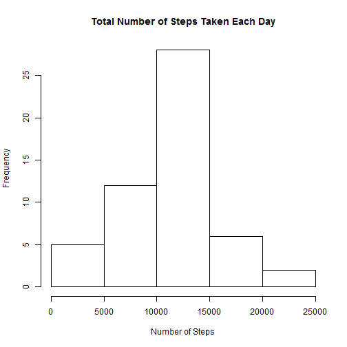
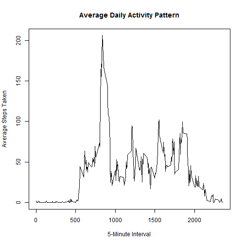
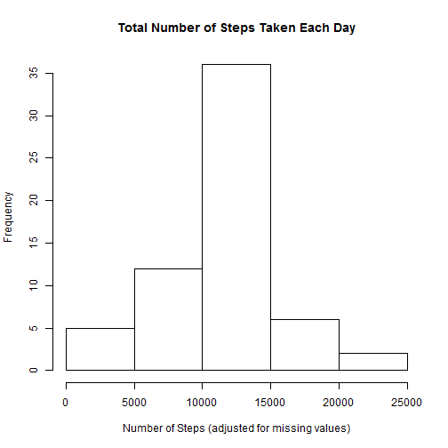
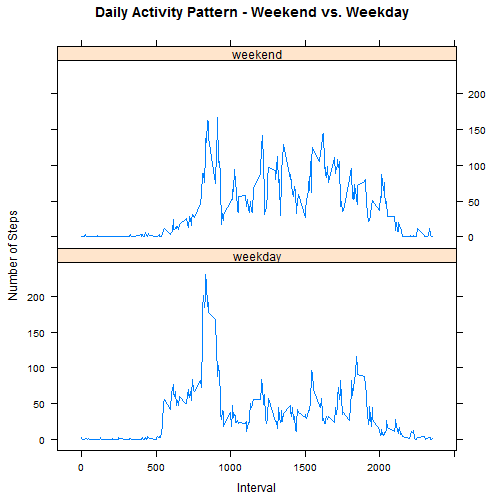

# Activity Monitoring Data Analysis  
  
  
## Introduction:

This analysis is an attempt to find patterns in the daily activity of individuals in "quantified self" movement - a group of enthusiasts who take measurements about themselves regularly to improve their health, to find patterns in their behavior, or because they are tech geeks. It is now possible to collect a large amount of data about personal movement using activity monitoring devices such as a [Fitbit](http://www.fitbit.com), [Nike Fuelband](http://www.nike.com/us/en_us/c/nikeplus-fuelband), or [Jawbone Up](https://jawbone.com/up).

A sample set of data is analyzed for this research using [R](https://www.r-project.org/about.html), a statistical computing and graphics language/environment.
  
  
## Data: 

This research makes use of data from a personal activity monitoring device. This device collects data at 5 minute intervals through out the day. The data consists of two months of data from an anonymous individual collected during the months of October and November, 2012 and include the number of steps taken in 5 minute intervals each day.


The dataset is stored in a comma-separated-value (CSV) file and there are a total of 17,568 observations in this dataset.

* Dataset: [Activity monitoring data](https://d396qusza40orc.cloudfront.net/repdata%2Fdata%2Factivity.zip) [52K]
  
The variables included in this dataset are:

* **steps**: Number of steps taking in a 5-minute interval (missing values are coded as `NA`)
* **date**: The date on which the measurement was taken in YYYY-MM-DD format
* **interval**: Identifier for the 5-minute interval in which measurement was taken

  
  
## Loading and preprocessing the data

The data is downloaded, uncompressed, and loaded into a data frame table using **dplyr** package.


```r
  ### Load dplyr package for easy data manipulation (install if needed)
  if (! require("dplyr")) {
    install.packages('dplyr'); 
    library(dplyr);
  }
```


```r
### Download file and load into a dataframe table 
download.file(url = "https://d396qusza40orc.cloudfront.net/repdata%2Fdata%2Factivity.zip", 
              destfile = "./activity.zip")
### unzip file
unzip("./activity.zip")
### load comma separeted data into data frame table
myTable <- tbl_df(read.csv("./activity.csv"))
```

Example of records:

```r
### view few records of sample data to see data is loaded
myTable
```

```
## Source: local data frame [17,568 x 3]
## 
##    steps       date interval
##    (int)     (fctr)    (int)
## 1     NA 2012-10-01        0
## 2     NA 2012-10-01        5
## 3     NA 2012-10-01       10
## 4     NA 2012-10-01       15
## 5     NA 2012-10-01       20
## 6     NA 2012-10-01       25
## 7     NA 2012-10-01       30
## 8     NA 2012-10-01       35
## 9     NA 2012-10-01       40
## 10    NA 2012-10-01       45
## ..   ...        ...      ...
```

Number of rows and columns:

```r
### check count to see all 17,568 observations are loaded
dim(myTable)
```

```
## [1] 17568     3
```

  
  
## What is mean total number of steps taken per day?
  
To analyze the data at the day level, the dataset is summarized at the date level. The observations with missing values were ignored. The total number of steps by date is calculated and then derived the mean and median of that total number of steps. 
    

```r
    ### 1. Calculate the total number of steps taken per day
    stepsByDay <-
        myTable %>%
        filter(!is.na(steps)) %>%
        group_by(date) %>%
        summarize(totalSteps = sum(steps)) 

    ### 2. Make a histogram of the total number of steps taken each day 
    hist(stepsByDay$totalSteps, main='Total Number of Steps Taken Each Day', xlab = 'Number of Steps')
```

 


```r
    ### 3a. Calculate the mean of the total number of steps taken per day
    meanSteps <- format(round(mean(stepsByDay$totalSteps, na.rm = TRUE), 2), nsmall = 2)
    
    ### 3b. Calculate the  median of the total number of steps taken per day
    medianSteps <- median(stepsByDay$totalSteps, na.rm = TRUE)
```
  
The mean total number of steps taken per day is : 10766.19  
The median total number of steps taken per day is : 10765  
    


## What is the average daily activity pattern?
  
To analyze the daily activity pattern, the dataset is summarized at the 5-minute interval level. The observations with missing values were ignored. The total number of steps by 5-minute interval is calculated and then derived the 5-minute interval with the maximum number of steps.  

  

```r
    ### 1. summarize number of steps by 5-minute interval
    stepsByInterval <-
        myTable %>%
        group_by(interval) %>%
        summarize(avgSteps = mean(steps, na.rm=TRUE)) %>%
        arrange(interval)
 
    ### 2. time series plot of the 5-minute interval (x-axis) 
            ### and the average number of steps taken, averaged across all days (y-axis)
    plot(x = stepsByInterval$interval, y = stepsByInterval$avgSteps, 
         type = 'l', 
         xlab = '5-Minute Interval', ylab = 'Average Steps Taken', 
         main = 'Average Daily Activity Pattern')
```

 


```r
    ### 2. Which 5-minute interval, on average across all the days, contains the maximum number of steps?
    max_step_interval <- as.numeric(arrange(stepsByInterval, desc(avgSteps))[1, 'interval'])
```
    
The 5-minute interval with maximum number of steps (on average across all the days in the dataset) is : 835  


## Imputing missing values

There are a number of days/intervals where there are missing values (coded as NA). The presence of missing days may introduce bias into some calculations or summaries of the data. So the missing values are imputed/replaced with a more appropriate value. The strategy used is to replace NA with the mean for that 5-minute interval. The plot, median, and mean are recalculated after filling in the missing values.  
    

```r
    ### 1. Calculate the total number of missing values in the dataset (i.e. the total number of rows with NAs)
    missing_values <- as.numeric(myTable %>% filter(is.na(steps)) %>% summarize(missingCount=n()) )
```
    
Number of observations with missing data : 2304  
    
    

```r
    ### 2. calculate Average/mean steps for each interval, to fill in the missing values later
    stepsByInterval <-
        myTable %>%
        group_by(interval) %>%
        summarize(avgSteps = round(mean(steps, na.rm=TRUE)))
    
    ### 3. Create a new dataset that is equal to the original dataset but with the missing data filled in.
    correctedTable <-
        myTable %>% 
        left_join(stepsByInterval, by = "interval") %>%
        mutate( steps = ifelse (is.na(steps), avgSteps, steps) ) %>%
        select(steps,date,interval)
    
    ### 4. Calculate the total number of steps taken per day after replacing the mising values
    stepsByDayCorrected <-
        correctedTable %>%
        filter(!is.na(steps)) %>%
        group_by(date) %>%
        summarize(totalSteps = sum(steps)) 
    
    ### 5. Make a histogram of the total number of steps taken each day 
    hist(stepsByDayCorrected$totalSteps, main='Total Number of Steps Taken Each Day', 
         xlab = 'Number of Steps (adjusted for missing values)')
```

 


```r
    ### 6. Calculate and report the mean of the total number of steps taken per day
    mean_steps2 <- format(round(mean(stepsByDayCorrected$totalSteps, na.rm = TRUE),2), nsmall = 2)
    
    ### y. Calculate and report the median of the total number of steps taken per day
    median_steps2 <- format(median(stepsByDayCorrected$totalSteps, na.rm = TRUE), nsmall=0)
```
   
  
The mean total number of steps taken per day, after replacing NA is : 10765.64  
The median total number of steps taken per day, after replacing NA is : 10762
    

**Do these values differ from the estimates from the first part (before imputing data)?**  
    Yes, the mean changed from 10766.19 to 10765.64 and the median changed from 10765  to 10762. 
    
**What is the impact of imputing missing data on the estimates of the total daily number of steps?**  
    The total number of steps increased slighlty, as well as the frequency of number of steps (as seen in the second histogram). The difference is very small in this case because the number of missing records is relativly low (2304 out of 17568).
    


## Are there differences in activity patterns between weekdays and weekends?  

The data set with filled-in values is used for this analysis. Based on the date a new factor is derived to identify whether it is a weekday or weekend. The data is then summarized by weekday/weekend and 5-minute interval to derive the average number of steps. Then a panel plot is created for weekend and weekday to see the activity pattern side by side. The plot is generated using the **lattice** package.


```r
  ### Load lattice package for easy data manipulation
  if (! require("lattice")) {
    install.packages('lattice'); 
    library(lattice);
  }
```


```r
    ### 1. Create a new factor variable in the dataset with two levels - "weekday" and "weekend" 
            # indicating whether a given date is a weekday or weekend
    correctedTable <- mutate(correctedTable, 
                             day = ifelse( weekdays(as.Date(date)) == "Sunday" 
                                           | weekdays(as.Date(date)) == "Saturday", 
                                    "weekend", "weekday"))
    
    ### 2.  calculate weekday/weekend average steps by interval 
    stepsByInterval2 <-
        correctedTable %>%
         group_by(day, interval) %>%
        summarize(avgSteps = mean(steps, na.rm=TRUE)) %>%
        arrange(interval)
    
    ### 3. Make a panel plot containing a time series plot of the 5-minute interval (x-axis) 
            # and the average number of steps taken, averaged across all weekday days or weekend days (y-axis). 
    xyplot(stepsByInterval2$avgSteps~stepsByInterval2$interval | stepsByInterval2$day,
           ylab="Number of Steps", xlab="Interval", 
           main="Daily Activity Pattern - Weekend vs. Weekday", 
           type = "l",
           layout=(c(1,2))
    )
```

 
  
  
## Documentation:

The analysis is documented in RMarkdown (Rmd) document and converted to html using **knitr** package.


```r
  ### Load knitr package for converting this Rmd doc to html (install if needed)
  if (! require("knitr")) {
    install.packages('knitr'); 
    library(knitr);
  }
  
  # convert Rmd document to html  
  knit2html('PA1_template.Rmd')
```

    
## Conclusion:

Based on the above analysis using the sample data set, the individuals in "quantified self" movement tend to be more active right before work on weekdays(around 7AM-9PM), however on wekends the activity could be scattered across the day time (7AM-7PM).

